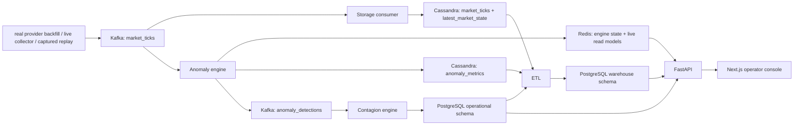

# Indian Equities Market Surveillance Platform

Distributed market surveillance, anomaly detection, contagion analysis, and warehouse analytics for Indian equities. The platform now runs in strict real-data mode: live and recent intraday bars come from real market feeds, older history can use real coarser bars, and replay only re-emits captured real sessions.

## What This System Does

- Ingests real market bars for Indian equities from `yfinance` today, with optional `Upstox` support wired through the same collector contract when credentials are supplied.
- Captures replay fixtures only from real market sessions; synthetic generators and fake minute expansion are no longer part of the runtime path.
- Streams normalized market records through Kafka so multiple services can process the same market feed reproducibly.
- Persists append-heavy operational facts in Cassandra and hot operator state in Redis.
- Detects price and volume anomalies in near real time using EWMA-based scoring.
- Detects sector contagion windows and stores those operational events in PostgreSQL.
- Loads a PostgreSQL star-schema warehouse for historical analysis, rollups, persistence studies, and analyst-friendly querying.
- Serves a polished operator console and warehouse analyst workbench through a single web application.

## Architecture



## Major Product Surfaces

- `Overview`: live tape, current alerts, active sector pressure, top movers, and recent contagion events.
- `Stocks`: full NSE directory, hydration tracking, stock search, screener views, and per-symbol workspaces.
- `Contagion`: sector propagation monitoring and recent contagion event investigation.
- `Warehouse`: analytical rollups, regime summaries, persistence analytics, intraday pressure profiles, and advanced warehouse insights.
- `Warehouse Analyst`: visual query builder over curated warehouse datasets with charts, CSV export, and print-to-PDF reporting.
- `Process`: step-by-step explanation of the entire pipeline from ingestion to warehouse analytics.
- `Methodology`: formulas, thresholds, signal semantics, and alert logic explained in product terms.
- `Replay`: captured-session replay controls for running the platform outside market hours without leaving real data behind.
- `System`: health, scale, run history, storage footprint, and operational readiness.

## Data Stores And Their Roles

- `Kafka`: replayable transport for normalized market bars and anomaly detections.
- `Cassandra`: operational intraday storage for market bars and anomaly metrics.
- `Redis`: anomaly engine restart state, latest market views, latest anomaly views, and freshness markers.
- `PostgreSQL operational schema`: ingestion runs, ETL runs, alerts, and contagion events.
- `PostgreSQL warehouse schema`: stock, sector, date, time, and exchange dimensions plus fact tables and materialized views for analytics.

## Monorepo Layout

- `infra/`: Dockerfiles, Cassandra schema, PostgreSQL init and runtime migrations, and Redis config.
- `services/collector`: real-data backfill, captured replay, purge, and live polling collectors.
- `services/storage-consumer`: Kafka-to-Cassandra storage path.
- `services/anomaly-engine`: streaming anomaly detection and Redis state management.
- `services/contagion-engine`: sector-aware contagion detection and recompute tooling.
- `services/api`: FastAPI surface for operational and analytical reads.
- `services/etl`: warehouse ETL and staging logic.
- `shared/contracts`: shared Python models, utilities, analytics, and settings.
- `shared/scripts`: bootstrap, NSE universe sync, local launch, public tunnel launch, and smoke tests.
- `frontend`: Next.js operator console and analyst UI.
- `tests`: unit and integration-facing fixtures.
- `docs`: architecture notes and viva-facing support material.

## Quick Start

### Prerequisites

- Docker Desktop
- PowerShell
- Python 3.11+

### Local Setup

1. Copy `.env.example` to `.env`.
2. Ensure runtime folders exist:

   ```powershell
   powershell -ExecutionPolicy Bypass -File .\shared\scripts\bootstrap.ps1
   ```

3. Create the local virtual environment and install Python dependencies:

   ```powershell
   python -m venv .venv
   .\.venv\Scripts\pip install -r requirements.txt
   ```

4. Start the local stack:

   ```powershell
   docker compose up -d
   ```

5. Open:

- Frontend: `http://localhost:3000`
- API docs: `http://localhost:8000/docs`

## One-Click Local Launch And Public Tunnel

For daily use on Windows, the repo now includes double-click launchers:

- `Launch Market Surveillance.cmd`
- `Stop Market Surveillance.cmd`

### What The Launcher Does

- bootstraps runtime folders
- starts the full local Docker stack
- waits for the API and frontend to become available
- opens a public tunnel to the local frontend
- writes the tunnel URL to `tmp/public-url.txt`
- writes a launch summary to `tmp/launch-summary.json`

### Manual Script Usage

```powershell
powershell -ExecutionPolicy Bypass -File .\shared\scripts\start_stack_and_tunnel.ps1
```

Useful switches:

- `-Rebuild`: rebuild services before launching
- `-NoTunnel`: start locally without opening a public URL
- `-NoBrowser`: do not auto-open the browser
- `-LiveCollector`: also start the live collector profile
- `-TunnelProvider localhostrun|cloudflare|auto`: choose the public tunnel method

By default the launcher uses `auto`, which prefers `localhost.run` and falls back to Cloudflare quick tunnels if needed.

### Start On Windows Sign-In

To place the launcher in the Windows Startup folder:

```powershell
powershell -ExecutionPolicy Bypass -File .\shared\scripts\install_startup_shortcut.ps1
```

To remove that startup shortcut later:

```powershell
powershell -ExecutionPolicy Bypass -File .\shared\scripts\install_startup_shortcut.ps1 -Remove
```

## Data Collection Modes

### Captured Replay

Replay is now real-data-only. A fixture must be captured from an actual market session first, and replay simply re-emits those normalized real bars through Kafka, Cassandra, Redis, contagion detection, ETL, and the warehouse layer.

```powershell
docker compose --profile tooling run --rm collector python -m collector.main replay --fixture tests/fixtures/replay_ticks.real.jsonl --speed 30
```

To capture a fresh real replay session:

```powershell
docker compose --profile tooling run --rm collector python -m collector.main capture-replay --symbols RELIANCE.NS HDFCBANK.NS ICICIBANK.NS INFY.NS TCS.NS --period 5d --interval 1m --output tests/fixtures/replay_ticks.real.jsonl
```

### Live Market Polling

```powershell
docker compose --profile live up -d collector-live
```

### Backfill

```powershell
docker compose --profile tooling run --rm collector python -m collector.main backfill --symbols RELIANCE.NS TCS.NS INFY.NS
```

Useful backfill switches:

- `--interval 1m|5m|15m|1h|1d`
- `--period 5d|1mo|3mo|1y`
- `--start-date YYYY-MM-DD --end-date YYYY-MM-DD`
- `--persist` to update the default captured real replay file

### Purging Old Synthetic-Derived State

If you are migrating an older mixed-data database, wipe the synthetic-derived operational and warehouse state before reloading:

```powershell
docker compose --profile tooling run --rm collector python -m collector.main purge-derived
```

## Warehouse And Analyst Features

The warehouse is not just a reporting dump. It is designed as an analyst-facing consolidation layer.

Current analytical capabilities include:

- minute-grain anomaly facts
- stock-day anomaly and contagion rollups
- sector-day and sector-month summaries
- sector regime analysis
- stock persistence and recurrence analytics
- intraday pressure profiling
- contagion event warehousing
- interactive analyst query builder
- CSV export and browser-native PDF report generation

The analyst workbench is available at:

- `http://localhost:3000/warehouse/analyst`

## Testing And Validation

### Backend Unit Tests

```powershell
docker compose exec api python -m pytest -q
```

### Frontend Production Build

```powershell
docker compose exec frontend npm run build
```

### Full Website Smoke Test

The repo includes a reusable smoke-test harness that checks major pages and core API flows:

```powershell
powershell -ExecutionPolicy Bypass -File .\shared\scripts\smoke_test_site.ps1
```

The smoke test covers:

- main UI routes
- stock directory and stock workspace
- contagion and warehouse APIs
- warehouse query metadata and live query execution
- replay status and system health

## Performance Notes

Recent optimizations in the repo include:

- GZip compression on the FastAPI layer
- cached warehouse summary and materialized-view endpoints
- bulk daily-history loading for screener and peer comparison paths
- homepage data consolidation so the overview route avoids redundant extra requests
- lighter live tape payloads because company names now ride on the latest market record

## Demo Checklist

For a polished demo, the recommended path is:

1. Start the stack with `Launch Market Surveillance.cmd`
2. Confirm the public tunnel URL from `tmp/public-url.txt`
3. Open `Overview` for the live tape and alert queue
4. Open `Stocks` and search a symbol workspace
5. Open `Contagion` for sector propagation events
6. Open `Warehouse` and `Warehouse Analyst`
7. Open `Process` and `Methodology` for architecture and formula walkthroughs
8. Use `Replay` if you need an after-hours demo sourced from a captured real session

## Design Principles

- UTC is the system of record for timestamps; IST trading semantics are preserved for business logic and UI.
- The platform is strict real-data-only at runtime; replay is allowed only for fixtures captured from real sessions.
- Cassandra is used only for operational write-heavy access patterns, not warehouse-style OLAP.
- Contagion events are kept relational because they are dashboard- and join-friendly.
- Warehouse facts are separated by grain rather than mixed into a single ambiguous table.
- Captured replay is a first-class capability, not an afterthought.

## Contributors

- [aryan1078](https://github.com/aryan1078)
- [H484811](https://github.com/H484811)
- [Tathya-25](https://github.com/Tathya-25)
- [h20250161-sys](https://github.com/h20250161-sys)
